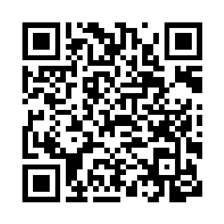

# KmChain

Registro público e à prova de adulteração da quilometragem de veículos, gravado em blockchain (Ethereum/Sepolia). Qualquer pessoa consulta de graça, sem carteira e sem cadastro; só o DETRAN e as entidades por ele credenciadas (oficinas e centros de vistoria) podem gravar novas leituras.

**Site publicado:** https://kmchain-web.vercel.app

## Por que

Odômetro se adultera. Uma vez gravada em cadeia, uma leitura não pode ser apagada nem sobrescrita — só contestada por uma correção do DETRAN, que fica igualmente visível ao lado da leitura original. Isso dá a qualquer comprador a possibilidade de conferir o histórico completo de um veículo antes de fechar negócio.

## Como usar

### Qualquer pessoa (consulta pública)

Não precisa de carteira, MetaMask ou cadastro.

1. Acesse o [site](https://kmchain-web.vercel.app).
2. Digite o chassi (17 caracteres) que consta no documento do veículo, **ou** clique em "Escanear QR Code" e aponte a câmera para a etiqueta.
3. Veja o histórico completo: cada leitura, sua data, o tipo de evento (cadastro, vistoria, revisão, transferência, sinistro, correção) e a entidade que assinou. Um selo indica se o histórico está totalmente documentado.

**Experimente agora** com um veículo já cadastrado na rede de testes:

<p align="center">
  
</p>

- Chassi: `7GTNRJMVMHW482160`
- Ou abra direto: https://kmchain-web.vercel.app/?chassi=7GTNRJMVMHW482160

### DETRAN, vistorias e oficinas (painel profissional)

Clique em "Acesso para DETRAN, vistoria e oficinas credenciadas" no rodapé da home. O acesso tem duas camadas, nessa ordem:

1. **Login e senha** (conta própria, guardada com hash em banco SQL). Quem ainda não tem conta pode criar uma na hora, só com nome, e-mail e senha — a função da entidade (oficina, vistoria ou DETRAN) é atribuída depois pelo DETRAN, ao credenciar a carteira vinculada à conta.
2. **Carteira MetaMask credenciada na rede Sepolia.** Criar a conta de login não dá nenhum acesso por si só — é o DETRAN quem credencia a carteira em cadeia, exatamente como antes. Depois de logar, é possível vincular a carteira à conta (assinando uma mensagem) para o DETRAN localizá-la mais rápido na lista de contas pendentes.

O que aparece no painel depende do papel da carteira conectada, conferido em tempo real no próprio contrato:

| Papel | Pode fazer |
|---|---|
| Oficina / Vistoria | Registrar leitura (com documento comprobatório opcional) |
| DETRAN | Tudo acima, além de cadastrar veículo, corrigir leitura equivocada, definir limites de avanço diário e consultar os registros privados |
| Admin (dono do contrato) | Credenciar ou revogar o acesso de outras carteiras, e ver as contas de login aguardando credenciamento |

Cadastro de veículo e transferência de propriedade também pedem o nome e o CPF do proprietário atual (e o cadastro, a placa). Esses dados **não vão para a blockchain** — ficam só no banco SQL, junto do nome de quem de fato realizou o serviço (não só a carteira que assinou), e só o DETRAN consegue consultá-los.

Toda leitura com avanço de quilometragem muito acima do plausível para o período exige uma segunda confirmação explícita antes de ser gravada — e fica marcada como atípica no histórico público, em vez de ser bloqueada (o que impediria uso legítimo intenso, como frotas).

## Como funciona por baixo

- **Contrato** (`contratos/`): um único `KmChainRegistry.sol`, escrito em Solidity, guarda os veículos e o histórico de leituras indexados pelo hash do chassi. Papéis (DETRAN, vistoria, oficina) são geridos via `AccessControl` da OpenZeppelin.
- **Documentos**: o arquivo comprobatório (nota fiscal, laudo de vistoria) nunca vai para a blockchain. Só o SHA-256 dele é gravado em cadeia; o arquivo em si fica no IPFS via Pinata, **cifrado com AES-256-GCM** pelo servidor antes do envio (nem o nome original do arquivo vai para lá). A chave (`DOCS_KEY`) existe só no servidor, que decifra o arquivo apenas para uma carteira que prove (assinando uma mensagem) ter um papel credenciado — e ainda confere se o arquivo decifrado tem exatamente o hash registrado em cadeia.
- **Login e dados privados** (`web/api/auth/`, `web/api/privado/`): banco SQL (Postgres) guarda a conta de login de cada entidade (senha com hash bcrypt, sessão em cookie HttpOnly assinado por HMAC) e os dados que a blockchain nunca deveria expor — placa, CPF e nome do proprietário atual, e o nome de quem, de fato, realizou cada serviço (não só a carteira). A leitura desses dados exige, além do login, a mesma prova por assinatura usada nos documentos: só quem tem `DETRAN_ROLE` em cadeia consulta.
- **Frontend** (`web/`): React + Vite, conversando com o contrato via `ethers.js`. Funciona de graça para consulta (RPC público) e exige login + MetaMask só para quem for gravar algo.

## Rodando localmente

```bash
# Contrato: compila e roda os testes
cd contratos
npm install
npx hardhat test

# Frontend: sobe em http://localhost:5173
cd web
npm install
npm run dev
```

O frontend precisa de um `.env` (endereço da rede, RPC público) e um `.env.local` (chave da Pinata, RPC do backend, `DATABASE_URL` do Postgres, `SESSION_SECRET` do login e `DOCS_KEY`, a chave AES-256 dos documentos) — veja `web/.env` e `web/.env.local` para as variáveis esperadas. As tabelas do banco são criadas sozinhas (`CREATE TABLE IF NOT EXISTS`) na primeira chamada às rotas de login.

## Stack

Solidity · Hardhat · OpenZeppelin AccessControl · React · Vite · ethers.js · IPFS/Pinata · Postgres · bcrypt · Vercel
